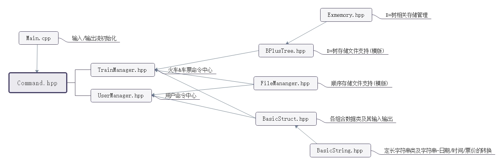

# 后端架构

## 文件关系

## 存储方式

| 信息 | 存储方式 | Key | Value | 备注 |
| ------ | ------ | ------ | ------ | ------ |
| 用户资料 | 顺序 | UserId(size_t) | Name,Passwd, Email,Phone,Priv | 无 |
| 车辆资料 | B+树 | TrainId(String) | Name,Catalog,KindName[], KindNum,LocNum, *StationPos，LeftPos[]* | Leftpos亦作为发售状态标记使用 |
| 站点资料 | 顺序 | StationPos(size_t) | LocName,Price[], Time1,Time2 | 初始版本中确定站点数为60并与Train合并 |
| 已售票资料 | 顺序 | LeftPos(size_t) | TicketSold(short) | 按售票时序插入 |
| 已购票资料 | B+树 | UserId(size_t),Catalog, TrainId,Loc1,Loc2 | TicketBought(short) | 支持仅UserId相同的批量读取 |
| 站点-列车索引 | B+树 | Loc,TrainId，Catalog | LocPlace(short) | 支持仅Loc相同的批量读取 |

## 车次

###插入、删除和修改

车次信息以TrainId为索引存储于B+树中，并以一个标记表示列车处于未发售/已发售/已删除状态。初始版本中，车站信息均以最大站点数60与车次信息一同存储，申请了过多额外空间。最终版本中，由于车站信息分离于顺序文件中存储，修改/删除操作将导致原列车车站信息对应的外存空间被浪费。

### 信息预处理

输入时间后将时间改为以始发站00:00为初始时间的时间偏移量，便于计算最速中转与行驶过程中的跨日期。票价改为前缀和计数，便于求差获得任一特定段的票价。

### 发售

列车发售后其信息将被插入站点-列车索引，由此可以被车票查询指令查询到。详见车票-直接查询/带中转查询。

## 车票 

### 查询

查询时从站点-列车索引中读出始发站和终点站对应的两列TrainId-Catalog-LocPlace组，其中TrainId保证升序。过滤Catalog并比较LocPlace保证列车方向正确后读取Train.StationPos，输出时间、票价等信息。

### 带中转查询

查询时从站点-列车索引中读出始发站和终点站对应的两列TrainId-Catalog-LocPlace组，从经过始发站的TrainId开始枚举其后经过的可能中转站点，对中转站点和终点站查询车票并通过Time偏移量筛选最速方案。

## 购票

### 余票记录

对一个特定车次-日期的购票操作第一次发生时，生成一组已售票记录并插入于记录尾端，记录位置。

### 购票记录

就是B+树插入而已。非常菜。

