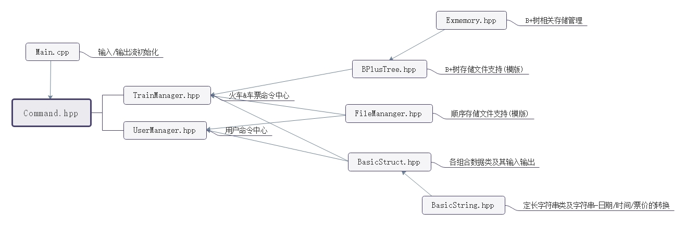

# 后端架构

## 文件关系

## 存储方式

| 信息 | 存储方式 | Key | Value | 备注 |
| ------ | ------ | ------ | ------ | ------ |
| 用户资料 | 顺序 | UserId(size_t) | Name,Passwd, Email,Phone,Priv | 无 |
| 车辆资料 | B+树 | TrainId(String) | Name,Catalog,KindName[], KindNum,LocNum, *StationPos，LeftPos[]* | Leftpos亦作为发售状态标记使用 |
| 站点资料 | 顺序 | StationPos(size_t) | LocName,Price[], Time1,Time2 | 初始版本中确定站点数为60并与Train合并 |
| 已售票资料 | 顺序 | LeftPos(size_t) | TicketSold(short) | 按售票时序插入 |
| 已购票资料 | B+树 | UserId(size_t),Catalog, TrainId,Loc1,Loc2 | TicketBought(short) | 支持仅UserId相同的批量读取 |
| 站点-列车索引 | B+树 | Loc,TrainId，Catalog | LocPlace(short) | 支持仅Loc相同的批量读取 |

## 车次

### 插入、删除和修改

车次信息以TrainId为索引存储于B+树中，并以一个标记表示列车处于未发售/已发售/已删除状态。初始版本中，车站信息均以最大站点数60与车次信息一同存储，申请了过多额外空间。最终版本中，由于车站信息分离于顺序文件中存储，修改/删除操作将导致原列车车站信息对应的外存空间被浪费。

### 信息预处理

输入时间后将时间改为以始发站00:00为初始时间的时间偏移量，便于计算最速中转与行驶过程中的跨日期。票价改为前缀和计数，便于求差获得任一特定段的票价。

### 发售

列车发售后其信息将被插入站点-列车索引，由此可以被车票查询指令查询到。详见车票-直接查询/带中转查询。

## 车票 

### 查询

查询时从站点-列车索引中读出始发站和终点站对应的两列TrainId-Catalog-LocPlace组，其中TrainId保证升序。过滤Catalog并比较LocPlace保证列车方向正确后读取Train.StationPos，输出时间、票价等信息。

### 带中转查询

查询时从站点-列车索引中读出始发站和终点站对应的两列TrainId-Catalog-LocPlace组，从经过始发站的TrainId开始枚举其后经过的可能中转站点，对中转站点和终点站查询车票并通过Time偏移量筛选最速方案。

## 购票

### 余票记录

对一个特定车次-日期的购票操作第一次发生时，生成一组已售票记录并插入于记录尾端，并于Train.LeftPos[Date]记录位置。

### 购票记录

生成一组已购票记录，插入B+树，以UserId为第一关键字以方便批量查询。

## B+树

### 原理

Akina中使用的B+树是不维护删除操作的带内存池的B+树。删除操作通过删除标记实现。
B+树部分由两个文档组成，ExMemory.hpp进行硬盘空间管理，BPlusTree.hpp为B+树主体，内含缓存池BufferPool类。

### 硬盘空间管理

使用ExMemory.hpp，用链表维护当前可用空间的范围，支持申请，释放和初始化操作。

#### 接口

- 构造函数
  `ExMemory()`
  
- 与管理文件建立链接
  `void SetName(const std::string &MMFName)`
  
- 初始化
  `void clear()`
  
- 申请空间
  `off_t malloc(size_t size) `
  参数为空间大小，返回值为磁盘空间的起点。
  
- 释放空间
  `void free(off_t start,size_t size) `
  释放以start为起点，大小为size的空间。

- 读取管理信息操作
  `void read_info()`

- 储存管理信息操作
  `void write_info()`
  
### B+树类

使用BPlusTree.hpp，维护一个带缓存池的B+树模板。

#### 模版说明

`template <class Key,class Data,size_t Nodesize,class Cmp=std::less<Key>>`
Key 为B+树的键值类型（所有可以成为排序依据的键的联合键值），是不可重的,Data 为数据类型， Nodesize 为单次申请空间的大小（即一个Node节点或一个Block节点的大小），Cmp为Key类型的比较函数，用于构造B+树所需的比较操作。

#### 接口说明

- 构造函数
  `BPlusTree(const std::string &FName,const std::string &MMFName)`
  FName为存储B+树的文件名，MMFName为存储外存管理信息的文件名。

- 析构函数
  `~BPlusTree()`

- 查找函数
  `int Find(const Key &key,Data &data)`
  查找B+树中键值为key的记录的data，使用引用返回查到的data值。函数返回值为1表示查找成功，为0则查找失败。

- 删除函数
  `int Erase(const Key &key)`
  删除B+树中键值为key的记录。函数返回值为1表示删除成功，为0则删除失败。
  **事实并未使用此函数**

- 插入函数
  `int Insert(const Key &key,const Data &data)`
  查找B+树中键值为key数据为data的记录。函数返回值为1表示插入成功，为0则插入失败。

- 修改函数
  `int Modify(const Key &key,const Data &data)`
  修改B+树中键值为key数据为data的记录。函数返回值为1表示修改成功，为0则修改失败。

- 询问范围函数
  `int AskArr(const Key &key,std::function<bool(const Key &,const Key &)>CMP,sjtu::vector<Key> &vect1,sjtu::vector<Data> &vect2)`
  询问函数中，在传入的比较函数CMP的意义下，不大于也不小于Key值的所有记录列表，依序将Key存入vect1，Data存入Vect2。返回值为1表示询问成功，为0则询问失败。

- B+树大小
  `int Size()`

- 删库函数
  `void Clear()`
  欢迎删库跑路。

### 缓存池类

缓存池类BufferPool是BPlusTree类的一个内嵌类，运用LRU思想，存储最近使用的B+树节点。
运用一个map和priority_queue实现，map以结点在外存地址的编号为key，存储节点；priority_queue维护一个时间戳与编号的联合值，当超出大小限制后将时间戳最小的编号的节点出队，同时删除map中的节点。

缓存池类BufferPool是BPlusTree类的一个内嵌类，运用LRU思想，存储最近使用的B+树节点。
#### 接口说明

- 构造函数
  `BufferPool(BPlusTree * bpt = nullptr)`
  bpt为指向所属BPlusTree的指针。

- 析构函数
  `~BufferPool()`

- 从缓存池读入节点内存储的Key与儿子信息
  `void ReadBuffer(char * buffer,const off_t &pos)`
  为与无缓存池版本快速对接，多读一次。

- 向缓存池输出节点内存储的Key与儿子信息
  `void WriteBuffer(char * buffer,const off_t &pos)`
  为与无缓存池版本快速对接，多写一次。

- 从缓存池读入节点信息
  `Node ReadNode(off_t &pos)`
  为与无缓存池版本快速对接，多读一次。

- 向缓存池输出节点信息
  `void WriteNode(Node &p)`
  为与无缓存池版本快速对接，多写一次。

- 向缓存池输出新建节点信息
  `void WriteNewNode(Node &p,char * buffer)`
  为与无缓存池版本快速对接，多写一次。
